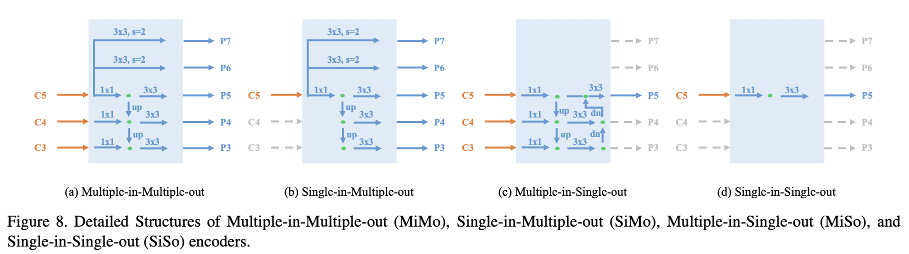

# You Only Look One-level Feature (YOLOF)

[Paper](arxiv.org/pdf/2103.09460.pdf)

## Overview

1. Utilizing only **one** level feature for detection
2. Dilated encoder
3. Uniform matching

### Single-input-single-out

### Dilated encoder

multiple scale range in from only C5 feature

### Uniform Matching

adopting the **k nearest** anchors as positive anchors for each gt box

### Framework

# Efficient Decoder-free Object Detection with Transformers (DFFT)

[Paper](arxiv.org/pdf/2206.06829.pdf)

Chunhua Shen Team

Tecent Youtu lab

## Overview
### They say: 
1. Eliminate the training **inefficient decoder**.
2. Leverage **two strong encoders**.
3. Explore **low-level** semantic features with limited computation.

### I say:
1. It makes a **trick** in name. It is actually a traditional encoder-neck-decoder structure.
2. It uses **YOLOF SiSo** (single-in single-out) structure.
3. The major contribution is an **efficient vision transformer backbone**.
4. A combination of backbone design and an existing decoder.
   
## **Method**
### **Framework**
----

- **Backbone+neck:** Detection-oriented Transformer Backbone (DOT)
- **Encoder:** Scale-aggregated Encoder (SAE)
- **Decoder:** Task-aligned encoder

### **Backbone: DOT**
----
#### **Patch embedding**
- Patch size $\frac{H}{8}\times\frac{W}{8}$.
#### **DOT Stage**

- Each DOT stage: **one DOT block**.
- Each DOT block: **multiple Swin** block (SW-MSA) and **one Xcit** block (global chennel-wise attention block). 
- Semantic-augmented Attention (SAA): exchange information between scale levels. 

##### **notation**
- $\hat{f}_i$ is Denoted as **DOT block** output.
- $\tilde{f}_i$ is denoted as **SAA** output.
- $f_i^{dot}$ is the final multiscale output
- $F_{block}$ is DOT block.
- $F_{se-att}$ is SAA.

##### **instantiations**
- **Four** DOT stages
- First stage: one DOT block but **no** SAA
- Other stages: one patch merging, one DOT block, one SAA and one downsampling

### **Encoder: Scale-aggregated encoder**
----

----

- Acutally plays as an FPN
- Aggregate at $\frac{1}{32}$

### **Task-alinged Encoder**
----

- Except QKV embbeding, all the linear projections of **Group Channelwise Attnetion** are conducted in two groups.
- Predict a **single-level** dense prediction with a **single** feature map. (raised by YOLOF)

## **Experiments**
### **ImageNet pretrain**
----

### **Main results**
----

### **Ablation study**
----
#### **Major components**
1. Replace DOT backbone with swin
2. Disable SAE by directly upsampling the $\frac{1}{64}$ to $\frac{1}{32}$
3. Replace TAE module with YOLOF head
   

#### **SAA**
Comparing with FPN on Retina head

#### **SAE**
Comparing with dilated encoder in YOLOF
