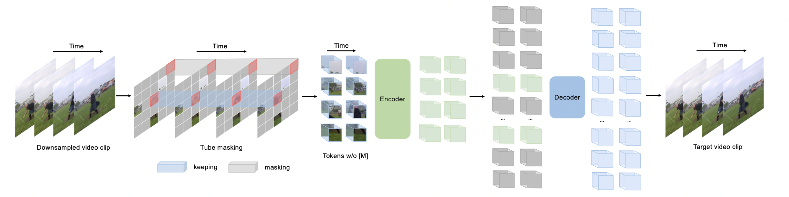

# Masked Autoencoders Are Scalable Vision Learners
[paper](arxiv.org/pdf/2111.06377.pdf)

Kaiming He  Facebook AI Research (FAIR)

## Overview

1. Encoder-decoder architecture
2. Encoder only operates on **visible** patches
3. Lightweidht decoder reconstructs original image from **latent representation** and **mask tokens**.
4. Maksing a high proportion of input image, i.e. **75%** yields the best performance
5. **High perframance** while **high efficiency**

## Intuition
*What makes masked autoencoding different between vision and language?*

- CNN is not straighforward to integrate **mask tokens** or **positional embeddings**.
- Information density is **low** in vision: masking a very **high** porition of image.
- Decoder is different, vision reconstruct **lower semantic** pixel, text reconstruct **rich semantic** word.

## Method

### Architecture

Encoder-decoder

#### Masking

Following ViT, images are divided into non-overlapping patches. Sampling  patches with **uniform distribution**.

Random sampling with a **high** ratio.

- Eliminates redundancy
- Prevents potential **center bias** (more maksed patches near the image center)
- **Efficient** encoder

#### MAE encoder

**ViT** applied only on visible, unmaksed patches. **No mask tokens** are used!

We can train very **large** encoders with only **fraction of** compute and memory.

#### MAE decoder

The input is 

- Encoded visible pathes
- Mask tokens: shared learned vector
- add positional embeddings

Same as **ViT** structure

At last, use linear projection to reconstrcut original image $N\times L \times C \rightarrow N\times L\times p*p*3$ reshape to $N\times 3\times H \times W$

$24*24\times C \rightarrow 24*24 \times 16*16*3 \rightarrow 224\times 224 \times3$

The MAE decoder is **only** used during pre-training, so the encoder has **<10%** computation per. token vs the encoder.

#### Reconstruction Target

- Predicting **pixel** values for each masked patch
- Loss: **mean squared error (MSE)**, **only on masked patches**

#### Implementation

1. Generate a token for each input patch (**linear projection** and **positional embedding**)
2. **Randomly shuffle** the tokens and **remove** the **last** portion of the list
3. After encoding, **append** masked tokens and **unshuffle** the list
4. Decoder is applied to full list

## ImageNet Experiments

### Settings

1. Pretrain by MAE unsupvisedly
2. finetune on imagenet supevisdly (updating **all** the model)
   1. or, linear probing on imagenet supevisdly (updating **only** the classifier)

Pretraining:

| config          | value  |
| --------------- | :----- |
| optimizer       | AdamW  |
| lr              | 1.5e-4 |
| batch size      | 4096   |
| warmup epochs   | 40     |
| Training epochs | 800    |

End to end finetune:

| config          | value           |
| --------------- | --------------- |
| optimizer       | AdamW           |
| lr              | 1e-3            |
| Batch size      | 1024            |
| warmup epochs   | 5               |
| training epochs | 100(B), 50(L/H) |

Supervised training from scratch

| config          | value            |
| --------------- | ---------------- |
| oprimizer       | AdamW            |
| lr              | 1e-4             |
| Batch size      | 4096             |
| Warmup epochs   | 20               |
| training epochs | 300(B), 200(L/H) |

linear classifier training: linear probing

| config         | value |
| -------------- | ----- |
| optimizer      | LARS  |
| lr             | 0.1   |
| Warmup epoch   | 10    |
| Training epoch | 90    |

### Baseline: ViT Large

| scratch | MAE finetune |
| ------- | ------------ |
| 82.5    | **84.9**     |

### Ablation

#### Masking ratio

#### Decoder

"ft" means **fine-tune**, "lin" means **linear probing**. **8block+512dim**, only 9% flops of ViT large

#### Mask token

Skip mask token in encoder

| case                 | fine-tune | linear probing | Flops |
| -------------------- | --------- | -------------- | ----- |
| Encoder with mask    | 84.2      | 59.6           | 3.3x  |
| Encoder without mask | **84.9**  | **73.5**       | 1x    |

#### Reconstrcution target

1. Pixels without normalization
2. Pixels with normalization
3. MAE predict tokens (from DALLE pretrained dVAE)

| case               | fine-tune | linear probing |
| ------------------ | --------- | -------------- |
| pixel with norm    | 84.9      | 73.5           |
| pixel without norm | **85.4**  | **73.9**       |
| dVAE               | 85.3      | 71.6           |

#### Data augmentation

Perform decently with **few** augmentation

| case             | finetune | linear probing |
| ---------------- | -------- | -------------- |
| none             | 84.0     | 65.7           |
| crop, fixed size | 84.7     | 73.1           |
| crop, rand size  | **84.9** | **73.5**       |
| crop, color jit  | 84.3     | 71.9           |

#### Mask sampling strategy

| case  | ratio | finetune | linear probing |
| ----- | ----- | -------- | -------------- |
| radom | 75    | **84.9** | **73.5**       |
| block | 50    | 83.9     | 72.3           |
| block | 75    | 82.8     | 63.9           |
| grid  | 75    | 84.0     | 66.0           |

#### Training schedule

### Comparison with previous results

#### Comparison with unsupervised

Advantage

1. Can **scale up** easily, up to $448\times 448$
2. comparing with BEiT, MAE is more **accurate** while being **simpler and faster**.
3. total pre-training time is **less** than the other methods when trained on the same hardware.

#### Comparison with supervised

### Partial finetuing

Linear probing misses **strong but non linear features**

Partial finetuning: finetune the **last several layers** while freezing others

### Transfer learning

#### COCO

#### Others

# SimMIM: a Simple Framework for Masked Image Modeling

[paper](arxiv.org/pdf/2111.09886.pdf)

MSRA

## Difference and similarity with MAE

- Masking strategy: use $32\times32$, but MAE use $16\times16$.
- Encoder input: use masked patches but MAE only use unmasked ones.
  - therefore SimMIM can use Swin
- Deocder design: use a linear layer, but MAE use transformer.
- loss: only masked part same as MAE

## Performace

ViT-B 224 imagenet1k

| method | fine tune | linear probing |
| ------ | --------- | -------------- |
| simMIM | **83.8**  | 56.7           |
| MAE    | 83.6      | **73.5**       |

Same as MAE conclusion

| case                 | fine-tune | linear probing | Flops |
| -------------------- | --------- | -------------- | ----- |
| Encoder with mask    | 84.2      | 59.6           | 3.3x  |
| Encoder without mask | **84.9**  | **73.5**       | 1x    |

## Extension

# ConvMAE: Masked Convolution Meets Masked Autoencoders

[paper](arxiv.org/pdf/2205.03892.pdf)

Shanghai AI lab, MMlab, SenseTime

## Overview

*Can MAE be used in ViT variants like (PVT, ConvViT) which use multicale and local inductive bias?*

- MAE in multiscale
- MAE in convolution

## Methods

### ConvMAE

- 3 Stages: $\frac{1}{4}$ and $\frac{1}{8}$: convolution, $\frac{1}{16}$: transformer

#### Block-wise Masking with Masked Convlutions

First generate the random mask 75% of **stage-3** input tokens -> upsample to stage-1 and stage-2

Use Masked Convlution Block

### Multiscale Decoder

$E_d=Linear(StrideConv(E_1,4) + StrideConv(E_2,2)+E_3)$

### ConvMAE for downstream tasks

- $E_4$ is obtained from $E_3$ with 2x2 **max pooling**
- Replace all but **1st, 4th, 7th, 11th** Global Attention with swin block

# VideoMAE: Masked Autoencoders are Data-Efficient Learners for Self-Supervised Video Pre-training

[paper](arxiv.org/pdf/2203.12602.pdf)

## Overview

- High proportion masking ratio in video (90% to 95%)

### Methods

#### Characteristics of Video Data

- Temporal redundancy
- Temporal correlation

#### Temporal downsampling

Based on **redundancy**, it sample frames with time stride $\tau=4\text{ or }2$.

#### Cube embedding

Take each cube of size $2\times 16\times 16$ as one token embedding, total $\frac{T}{2}\times\frac{H}{16}\times\frac{W}{16}$.

#### Tube masking

masking map is the same for all frames

#### Extremely high mask ratio

VideoMAE is in favor of **extremely high** masking ratios (90%-95%)

